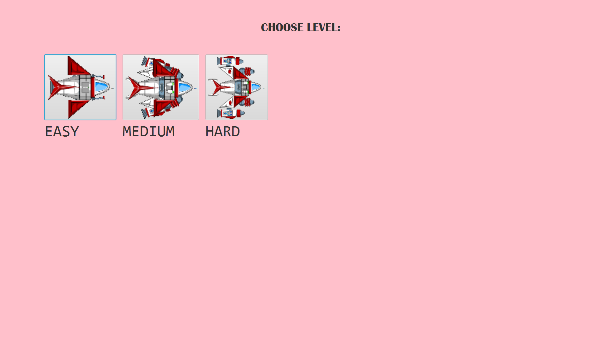
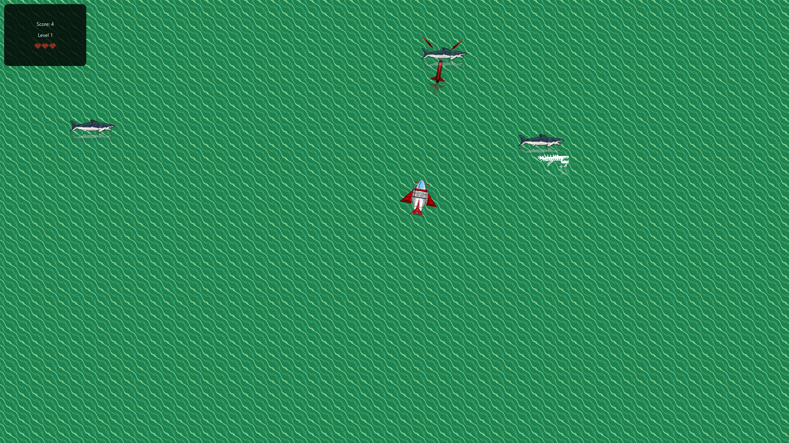
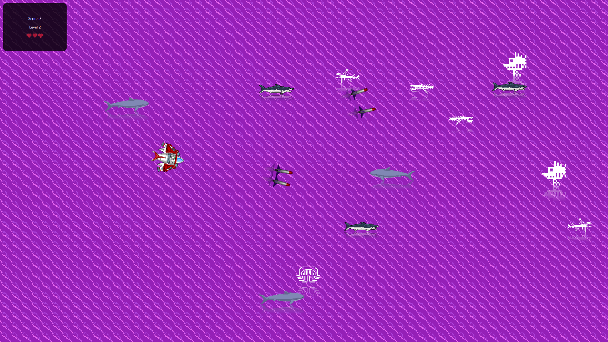
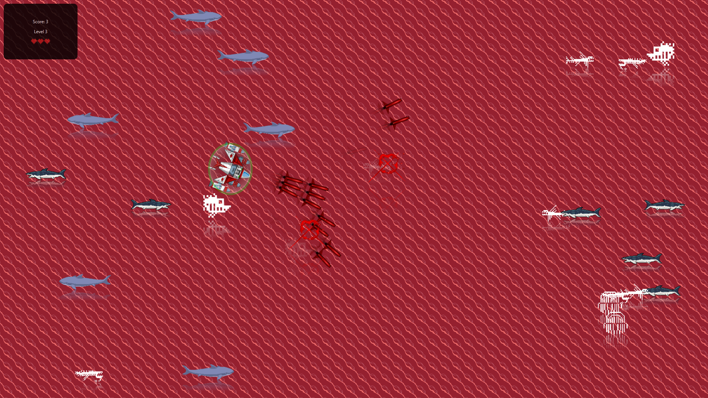

# FXOceanInvader
FXOceanInvader is a game that I completed from and modified from [GameEngine by Quillion](https://github.com/Quillion/GameEngine). Essentially it is a simple space invader game made in Java and JavaFX.

**Start Menu:**

**Level 1:**

**Level 2:**

**Level 3:**

## Game Mechanics 
The player is a ship that needs to destroy all the obstacles. As the level increase
you have more creatures to defeat, more missiles, and a bigger ship.

## Installation

Compile the JAR file using an IDE.

## Contributing

Pull requests are welcome. For major changes, please open an issue first
to discuss what you would like to change.

Please make sure to update tests as appropriate.

## License

[MIT](https://choosealicense.com/licenses/mit/)
